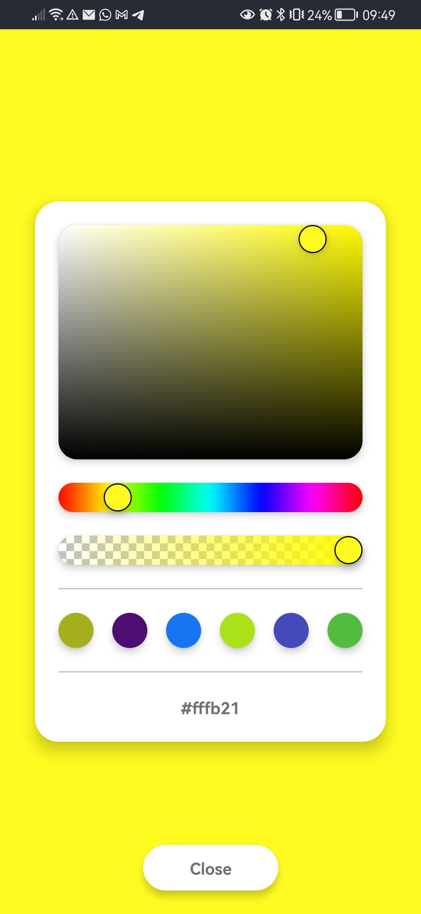
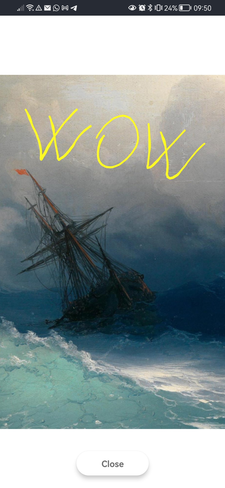

# Kvaravaggio 🎨

# About the app

Kvaravaggio is a drawing app that let users draw over a blank canvas or use a background image from their media library or camera. The application offers users the ability to customize the brush stroke's color and thickness, as well as erase parts of the drawing or clear the entire canvas. Once complete, the user can save the drawing.

The app was developed using React Native and Expo, which are both popular frameworks for building cross-platform mobile applications. TypeScript was also used to provide type safety and improve the overall maintainability of the codebase.

Several third-party libraries were used to provide additional functionality to the app, including @react-native-async-storage/async-storage for local storage, @react-navigation/native for navigation, expo-camera for taking pictures, and reanimated-color-picker for selecting colors.

# App screenshots 📷

